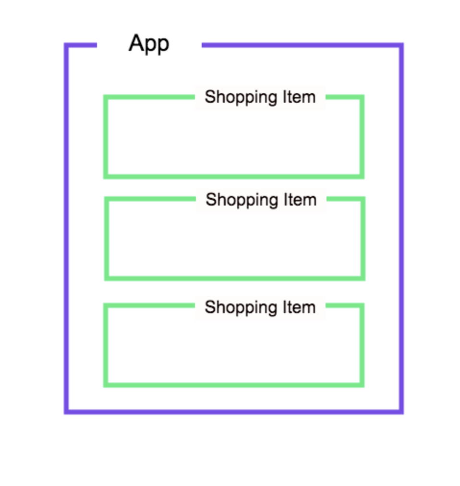

# Multiple Components and Props

**Lesson Duration: 60mins**

### Learning Objectives
- Understand how to register components
- Understand how to pass data down as props

## Intro

We've seen how to make Vue components. Next, we're going to see how to make components that we can re-use, for example, in a list.

Doing so means that we can add individual functionality and styling, and it makes our code more maintainable.

## Shopping List

We're going to go back to the shopping list app that we made earlier in the week, but this time, we'll create a reusable component for each item.

Lets have a look at what the component structure is going to look like.



`App` is our entry component, the component that is rendered into the `#app` element on the DOM.  `App` is where all of our shopping list items will live in state.  For each element within the shopping list we'll render a `ShoppingItem` component.

```bash
vue create shopping-list
```

We'll start off by stripping out the boilerplate code of `App.vue` and then creating our own component scaffolding with Atom's `language-vue` package.

Let's also give our page a header.

```html
<!-- App.vue -->
<template lang="html">
  <h1>My Shopping List</h1>
</template>

<script>
export default {
}
</script>

<style lang="css" scoped>
</style>
```

And then let's give the component a name, and some data.

```html
<!-- AS BEFORE -->
<script>
export default {
  name: 'app',
  data() { //NEW
    return {
      items: [
        {name: 'Milk', purchased: false},
        {name: 'Cheese', purchased: true},
        {name: 'Beans', purchased: false},
      ]
    };
  }
}
</script>
```

### Registering Components

We're going to render a list of shopping list items.  But instead of rendering them as `<li>` elements, we're going to render a shopping list item component.

First off, we'll make that file. Open a new terminal tab so that our app keeps running.

```bash
mkdir src/components
touch src/components/ShoppingItem.vue
```

In here, for the time being, let's just generate our scaffolding and within the template render a `<p>` tag to indicate this is a `shopping item component`.

```html
<!-- //ListItem.vue -->
<template lang="html">
  <p>Shopping item component</p>
</template>

<script>
export default {
  name: 'shopping-item'
}
</script>

<style lang="css" scoped>
</style>
```

Next, we're going to import this component where we need to use it.

### Using our custom component

Next, we're going to import our `ShoppingItem` within the `App` component.  We also need to register it under the `components` key.

> ensure there is a comma after the data function.  This is just a big JavaScript object.

```html
<template lang="html">
  <div class="">
    <h1>My Shopping List</h1>
    <shopping-item></shopping-item>
  </div>
</template>

<script>
import ShoppingItem from './components/ShoppingItem.vue'; //NEW

export default {
  name: 'app',
  data() {
    return {
      items: [
        {name: 'Milk', purchased: false},
        {name: 'Cheese', purchased: true},
        {name: 'Beans', purchased: false},
      ]
    };
  },
  components: {  //NEW
    'shopping-item': ShoppingItem
  }
}
</script>
```

You should see a `shopping-item` component being shown to the user in your browser.

### Component Naming Convention

It is recommended that component names should be multi-word, except for root App components.  This prevents conflicts with existing and future HTML elements, since all HTML elements are a single word.

The component name can be either be `kebab-case`, `camelCase` or `PascalCase`. So `list-item`, `listItem` or `ListItem`.  We'll stick to `kebab-case` as it looks more `html tag` like and we'll be rendering these components within our html templates.

## Passing Props

As it stands, we're just rendering one `list-item` component that has no relation to the data. Let's fix that.

Let's use a `v-for` directive to render a `list-item` component for each item in our data object.

```html
<!-- App.vue -->
<template lang="html">
  <div>
    <h1>My Shopping List</h1>
    <ul>
      <shopping-item v-for="(item, index) in items" :key="index"></shopping-item>  <!-- MODIFIED -->
    </ul>
  </div>
</template>
```
When we render list items in Vue we have to give each element a `key` which we can `bind` to the item.  This is to ensure that whenever an element of the list is changed the document will only re-render this item and not the whole list. Vue requires this attribute, and will throw a warning when it is not found.

Navigate to the browser and you should see 3 `shopping-item` components.

Now we want each of these `shopping-item` components to correlate with each item.  How do we do this?  By passing properties or `props` to the component.

`Props` are custom attributes you can register on a component. When a value is passed to a prop attribute, it becomes a property on that component instance.

Let's give each `shopping-item` a prop of `item` and bind that prop to the iteration of the item in the loop.

```html
<!-- App.vue -->
<template lang="html">
  <div>
    <h1>My Shopping List</h1>
    <ul>
      <shopping-item v-for="item in items" :key="index" :item="item"></shopping-item> <!-- MODIFIED -->
    </ul>
  </div>
</template>
```

We now have access to that item in our `shopping-item` component.  Let's update this component so that we now render `item.name` instead of our placeholder component message.

```html
<!-- ShoppingItem.vue -->
<template lang="html">
  <p>{{ item.name }}</p> <!-- MODIFIED -->
</template>
```
If we refresh the browser we see nothing.  And we now have an error message in the console saying `cannot read property 'name' of undefined`.

We've passed the prop down, but we still need to give the component a list of props it accepts.  We can do this using the `props` key. Since we're binding with `:item` in the component above, we need to use `item` here.

```html
<!-- ShoppingItem.vue -->

<!-- AS BEFORE -->
<script>
export default {
  name: 'shopping-item',
  props: ['item'] //NEW
}
</script>
```

Great, in the browser we can now see our shopping list items rendering.

## Adding Functionality

As it stands our shopping list doesn't have much functionality.  Let's change that.

We'll start off by creating a `div` wrapper as we'll be rendering multiple html elements.  Then, we'll add a purchased button to the component which only renders if the item has not been purchased with an `v-on:click` event to call the function `purchase` when clicked.

```html
<!-- ShoppingItem.vue -->
<template lang="html">
  <div class=""> <!-- NEW -->
    <p>{{ item.name }}</p>
    <button v-if="!item.purchased" v-on:click="purchase">Purchase</button>
  </div>
</template>
```

Let's set up that function. We can access the property of `item` by calling `this.item`.

```html
<!-- ShoppingItem.vue -->
<script>
export default {
  name: 'shopping-item',
  props: ['item'],
  methods: {  //NEW
    purchase(){
      this.item.purchased = true
    }
  }
}
</script>
```

We've defined our method here slightly different to how we were doing it earlier in the week,  this is an ES6 feature.  Method definitions are shorthand for a function assigned to a method name.

You will likely see both method definitions in Vue apps like you will with shorthand bind `:` and v-on `@` directives.  However for each of them, its good practice to be consistent with the style you choose to use.

Great, so we can now purchase items and the button to purchase disappears.  Nothing very exciting is happening though.

Let's give our component some styling that changes when an item is purchased.

```css
/* ShoppingItem.vue */
p {
  background-color: lightgoldenrodyellow;
}

.purchased {
  text-decoration: line-through;
  background-color: red;
}
```
Initially we'll set the background colour of the `<p>` tag to `lightgoldenrodyellow`. Then when the item has been purchased we want the background colour to be `red` with the text scored out. How do we achieve this? We can achieve this by binding this `.purchased` class to the `<p>` tag.

```html
<!-- ShoppingItem.vue -->
<template lang="html">
  <div class="">
    <p :class="{'purchased': item.purchased}">{{ item.name }}</p> <!-- MODIFIED -->
    <button v-if="!item.purchased" v-on:click="purchase">Purchase</button>
  </div>
</template>
```

Watch your syntax here - we open the directive with double quotes, then within the curly brackets the class name is passed as a string in single quotation marks.

This syntax means that the presence of the `.purchased` class depends on the truthiness of `item.purchased`.

If you navigate back to the browser you should now see this style change.  

## Recap

How do we make a component accessible to a parent component?
<details>
<summary>Answer:</summary>

We import it within the parent component and then register it in the parent component's `component` object.

</details>
<br />

How do we pass data down from a parent component to a child component?
<details>
<summary>Answer:</summary>

Via `props` - custom attributes that we can add to our components when we create them in our parent components' html, and register within the child components, allowing access to the data being passed down.

</details>
<br />

## Conclusion

We've seen how to build our own Vue components, which will allow us to separate the concerns of our app's functionality and make our code more maintainable. `.vue` files also allow us to have sight of a component's HTML, CSS and JavaScript all in the same file, allowing for simpler organisation of our code. Best of all, the concept of components means that we have code that can be reusable.
