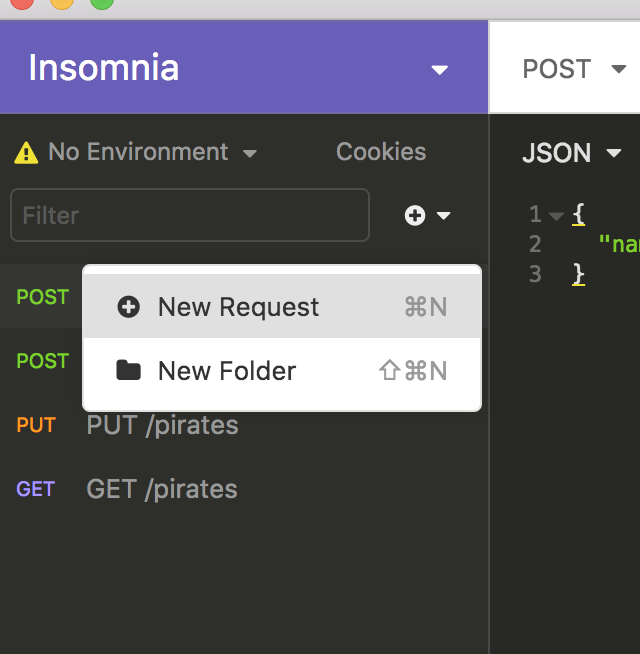
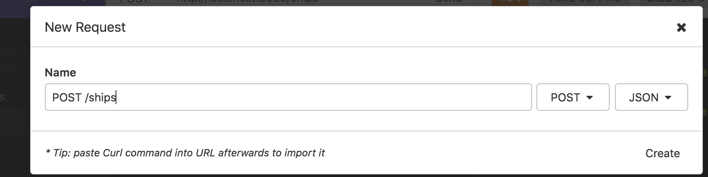
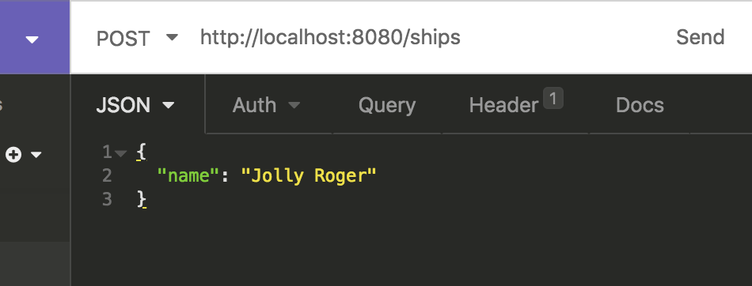

# Insomia + POSTing data

## Learning Objectives

Use Insomia to POST to API endpoints that have relationships.

## Introduction

When developing an API we need to be able to test that we can POST to the API endpoints given to us by Spring Data REST.

## POSTing related objects

Using Insomia, we can POST to create new entries against a particular collection.

When posting to a collection that has a related model, the related model needs to exist first.

For example, with `Pirate`s and `Ship`s, the related ship needs to exist first before the `Pirate` can be created. In Java, this `Ship` is required by the `Pirate` constructor, it takes a `Ship` instance as an argument.

## Making a new Request in Insomnia

First add a new request by selecting the ➕ 🔽 icon, and choose "New Request".



When naming a new request the convention is to first give it the type of request it is which in our case is POST and then the route that it is POSTing to so /ships

Since this is a POST request we need to give it a body so we are going to give it a JSON body.



Enter the URL and then the JSON body.

The JSON for a Ship will look like:

```json
{
  "name": "The Jolly Roger"
}
```



Click send to make the POST request.

The response will then show which ID that has been saved to if it's succesful. In this case it's 3.

```json
{
  "name": "The Jolly Roger",
  "_links": {
    "self": {
      "href": "http://localhost:8080/ships/3"
    },
    "ship": {
      "href": "http://localhost:8080/ships/3"
    },
    "pirates": {
      "href": "http://localhost:8080/ships/3/pirates"
    }
  }
}
```

When we go to <https://localhost:8080/ships> we can see that our new ship has been added.

## Adding an Existing Ship to a New Pirate

We can now create a Pirate on the Jolly Roger.

```json
// Insomnia: POST http://localhost:8080/pirates
{
  "firstName": "Captain",
  "lastName": "Hook",
  "age": 50,
  "ship": "http://localhost:8080/ships/3"
}
```

But we have an error. Our ship is null.

The `ship` is being completely ignored in our JSON, and the ship_id is `null` when we try to create a `Pirate`. This is because we are using `@JsonIgnore` on our `Pirate`'s `ship` property. This avoids an infinite loop: the Pirate refer to their Ship, the Ship refers back to the Pirates on board, which then refers to the Ship again, etc. Now we need our API to accept JSON for the new Pirate, including it's `ship` property, we can't ignore the ship entirely. However, we still need to avoid the infinite loop, so we can't safely remove `@JsonIgnore`. We can change it to use the `@JsonIgnoreProperties` annotation instead. This ignores only some properties, not the entire `ship`. We still want to know about the ship, just not about all of the pirates on the ship.

```java
// Pirate.java
    @JsonIgnoreProperties("pirates") // UPDATED
    @ManyToOne
    @JoinColumn(name = "ship_id", nullable = false)
    private Ship ship;
```

> Note: Running the application again will reset the DB (due to `spring.jpa.hibernate.ddl-auto = create-drop`). The Jolly Rodger won't be in the database any more, and we'll still have the null error. So either add the Pirate to a ship created in `DataLoader`. Or POST the Jolly Rodger again before you POST the Pirate

Now our POST request to create a new Pirate on the Jolly Roger should succeed.

Pay attention to the `ship` property. Instead of passing it just the id of a `Ship`, we pass it the url to the ship. It needs to have the link to related ship as a fully qualified URL.
