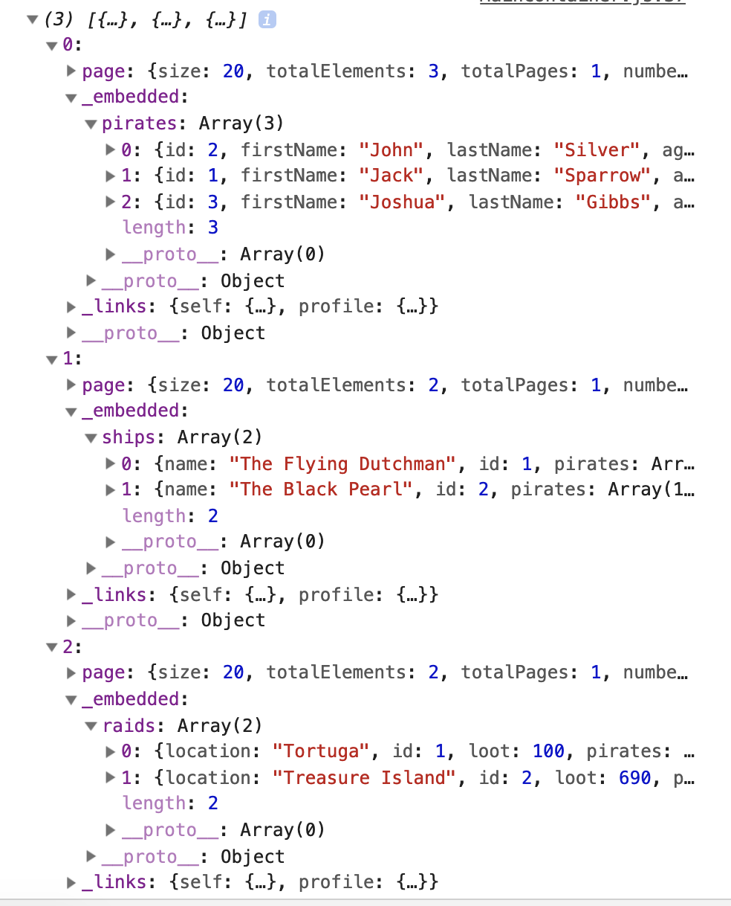

# React Requests - Pirate API

## Learning Objectives

- Understand how to make a call to our Pirate API using React.
- Understand how to write custom routes to get back the data we want.


## Duration
1 hour 30 minutes

# Intro

You all wrote awesome applications using the countries RESTful API in vanilla JS. In this lesson we are going to use React to make a HTTP request to our own Pirate API. As we saw with the Comments app, by setting the received data on our state, we trigger a re-render of our application, which we can use to populate our UI. Here we will see how React's component lifecycle methods can help us perform HTTP requests. We will also be using stateless functional components where possible.

# Rest APIs using HAETOS

Do you remember what Spring Data Rest gave us? It gave us HAETOS route that adhered to the 7 restful routes. The good news is that we can easily use these routes to connect to our own API.

If you haven't already, go and grab the JSON formatter extension for Chrome:

https://chrome.google.com/webstore/detail/json-formatter/bcjindcccaagfpapjjmafapmmgkkhgoa?hl=en

This will make it a lot easier to read our JSON results.

Let's have a look at the api we are going to use today - the PirateService api.

> Hand out start point and have students.
> Run the PirateService in IntelliJ and keep running for all lessons in this series. 

As you can see this back end is the same as we created last week with projections set for all 3 models to get back all the data associated with each.


### Task
Run the back-end application in IntelliJ.
Visit the HAETOS restful routes in your browser and look at the data.

So today we will be using 2 different types of URL in our apps.

We will be using `/pirates` in React to get back our list of pirates but also `/pirates` to hit our API

SO React will use http://localhost:3000/pirates and Spring will use http://localhost:8080/pirates to hit the API. Yuck! This could get really really confusing. So let's make it clearer by changing the base route for Spring so that we need to hit `/api/pirates` to get back the data from Spring.

In the Java code open application.properties and add the following line.

```xml
<!-- application.properties -->

spring.data.rest.basePath=/api
```

Now visit the browser and go to http://localhost:8080/api/pirates.

Great we now have our data back on this route so we will use that moving forward for whatever data we want. So if we wanted all ships it would be `/api/ships` etc...

So the main route we are going to use today is this one

http://localhost:8080/api/pirates

This gives us ALL the pirate data.

Let's have a go.

## React request

> Have students open front end code and look at it in atom. Note that we have a NavBar, route and css included.

Here we have a React application set up with a main controller. It is in here that we will make the request to the API to get back all of the data. We also have a route to `/pirates`. This triggers a render of a `PirateList`.

As we will be making multiple requests to get data we can abstract out the method to a helper. Just like we did in Vanilla JS. We have set up a request helper and coded in the `get` method like we had before.

```js
//request.js

class Request {

  get(url) {
    return fetch(url)
    .then((res) => res.json());
  }
}

export default Request;
```

 This has been imported into `MainContainer` to use.

```js
//MainContainer.js

import React, {Component} from 'react';
import {BrowserRouter as Router, Route, Switch} from 'react-router-dom';
import NavBar from '../NavBar.js';
import PirateList from '../components/pirates/PirateList';
import Request from '../helpers/request';

```

Now in our `MainContainer` we will fetch the data in `componentDidMount` and we will log out the data we get back initially.

As we will probably need access to `Ships` and `Raids` later on we will also get all of this data back in the one go and save it to state.

Let's start by setting up the state in the constructor.

```js
// MainContainer.js

constructor(props){
  super(props);
  this.state = {
    pirates: [],
    ships:[],
    raids: []
  } // ADDED
}

```

Next we will add componentDidMount method and set up our requests. For this we will be using Promise.all. (You can read more about this [here](https://developer.mozilla.org/en-US/docs/Web/JavaScript/Reference/Global_Objects/Promise/all).

Remember that `fetch` returns a Promise. We can assign this promise to a variable and add to an array.

When we have the 3 promises we can pass these to Promise.all and this will go through each promise and resolve them.

This will send us back an array with the 3 sets of data. We can then access that array and assign the relevant data to our state.

Let's create the promises and save them in an array.

```js
//MainContainer.js

class MainContainer extends Component {
  constructor(props){
    super(props);
    this.state = {
      pirates: [],
      ships:[],
      raids: []
    }
}

  componentDidMount(){ // ADDED
  const request = new Request()

  const promise1 = request.get('/api/pirates');

  const promise2 = request.get('/api/ships');

  const promise3 = request.get('/api/raids');

  const promises = [promise1, promise2, promise3];
}
}
```

Next we will use Promise.all and pass in the array and then log out what is returned.

```js
//MainContainer.js

componentDidMount(){
  const request = new Request()

  const promise1 = request.get('/api/pirates');

  const promise2 = request.get('/api/ships');

  const promise3 = request.get('/api/raids');

  const promises = [promise1, promise2, promise3];

  Promise.all(promises).then((data) => {
    console.log(data);
  })
}
```
## Proxy

Next thong to deal with is when we make a fetch request in React the request is actually sent to `localhost:3000/api/pirates`.

We don't want this... we want to hit `localhost:8080/api/pirates`.

We could pass in the full url into the get but then this would give us CORS errors that we would need to deal with in our Spring app.

A better way around this is to assign a `proxy` value in our `package.json`

With the proxy any requests that are sent out of the application will use the proxy rather than reacts. So if we set the proxy to `http://localhost:8080/` any fetch request will use the Spring server.

So our fetch `/pirates` will actually resolve to `http://localhost:8080/api/pirates`.

```json
"browserslist": [
    ">0.2%",
    "not dead",
    "not ie <= 11",
    "not op_mini all"
  ],
  "proxy": "http://localhost:8080/" */ ADDED /*

```

> Note you may have to restart the server for this to take effect.

Cool so now we are able to get the data back.

If we look at the data we see an array with our pirates, ships and raids embedded in each entry.



So now all we need to do is set the state.

```js
// MainContainer.js

componentDidMount(){
  const request = new Request()

  const promise1 = request.get('/api/pirates');

  const promise2 = request.get('/api/ships');

  const promise3 = request.get('/api/raids');

  const promises = [promise1, promise2, promise3];

  Promise.all(promises).then((data) => {
    this.setState({
      pirates: data[0]._embedded.pirates,
      ships: data[1]._embedded.ships,
      raids: data[2]._embedded.raids})
    })
  }
  ```


Let's amend the route and pass in props to the PirateList. In order to pass in props to a component in route we need to use the `render` option rather than `component`.

Render gives us access to props and allows us to pass props to a component. (Just like the normal render method).

```js
//MainContainer.js

<Route exact path="/pirates" render={(props) =>{
        return <PirateList pirates={this.state.pirates}/>
      }}/>
```

In PirateList we will now log out the props.pirates and make sure we have our data.

```js
//PirateList.js

console.log(props.pirates);
return (
  <div>Im a list of pirates!</div>
)
```

Cool we can now see the pirates array being logged out from within PirateList.

We will change the `div` and instead we will use a `ul` to display a list of Pirate components.

So first we want to create an li tag for each Pirate. To do this we want to loop over the array of pirates and return a collection of `li` tags with a `Pirate` component in each. We also want each individual `Pirate` object passed into them in turn.

We can use `Array.map` to achieve this.

We will also add a surrounding div for CSS purposes. The div will have a `className` of component to apply the CSS.

```js
//PirateList.js

const pirates = props.pirates.map((pirate, index) => {
  return (
    <li key={index} className="component-item">
    <div className="component">
    <Pirate pirate={pirate} />
    </div>
    </li>
  )
})
```

Next we will change the div to a ul and render the `li` elements inside.

```js
//PirateList.js

return (
  <ul className="component-list">
    {pirates}
  </ul>
) // MODIFIED
```


Cool so we should now see a list of divs with `I am a pirate` displayed.

Lets change this to display the Pirates details. We will put this in a React.Fragment for something we will use later on.

```js
//Pirate.js
const Pirate = (props) => {

  if (!props.pirate){
    return "Loading..."
  }
  return (
    <React.Fragment>
    <p>
    {props.pirate.firstName} {props.pirate.lastName}
    </p>
    <p>Age: {props.pirate.age}</p>
    <p>Ship: {props.pirate.ship.name}</p>
    </React.Fragment>
  )
}

```

Fantastic we now have a list of pirates showing all their details.

#Task
- Fetch all Ships and raids.

# Summary
- Learned how to make a call to our Pirate API using React.

# Next Lesson
- Display a single pirate details
