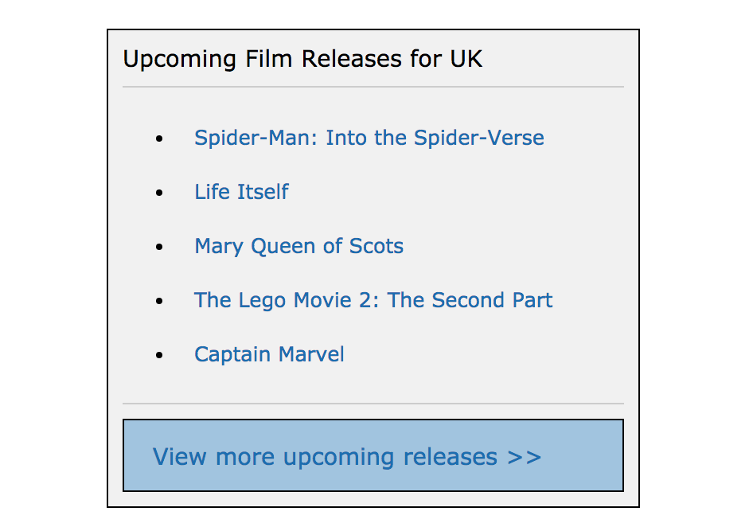

# React: Film Releases

## Reading

[Thinking In React](https://reactjs.org/docs/thinking-in-react.html) (20 mins)

## Practice

You task is to plan and build an application that displays a list of upcoming film titles, each one linking to their [imdb](https://www.imdb.com/) page.


*Screenshot of example result*

- Draw out the UI on paper, breaking it down into components.
- Draw a component hierarchy diagram, noting down any state and props for each component.
- Implement the application in React.

Note: The 'View more upcoming releases' button can link to the imdb calendar page - [https://www.imdb.com/calendar/?region=gb](https://www.imdb.com/calendar/?region=gb)

### Data

You can use the following data to display in your application:

```js
[
  {
    id: 1,
    name: "Dora and the Lost City of Gold",
    url: "https://www.imdb.com/title/tt7547410/?ref_=rlm"
  },
  {
    id: 2,
    name: "Downton Abbey",
    url: "https://www.imdb.com/title/tt6398184/?ref_=rlm"
  },
  {
    id: 3,
    name: "Rambo: Last Blood",
    url: "https://www.imdb.com/title/tt1206885/?ref_=rlm"
  },
  {
    id: 4,
    name: "Zombieland: Double Tap", 
    url: "https://www.imdb.com/title/tt1560220/?ref_=rlm"
  },
  {
    id: 5,
    name: "The Addams Family",
    url: "https://www.imdb.com/title/tt1620981/?ref_=rlm"
  }
]
```
