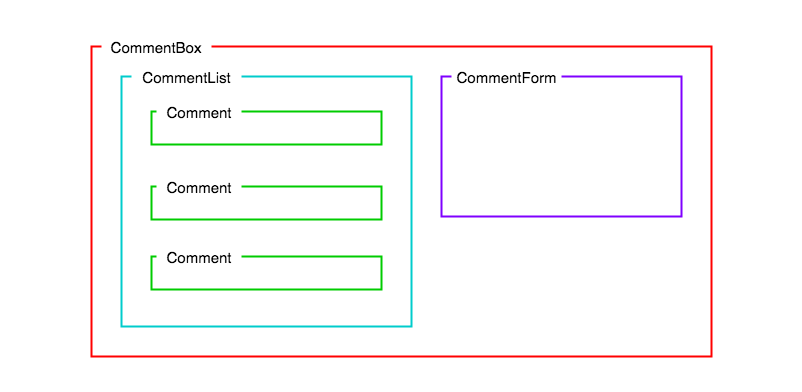
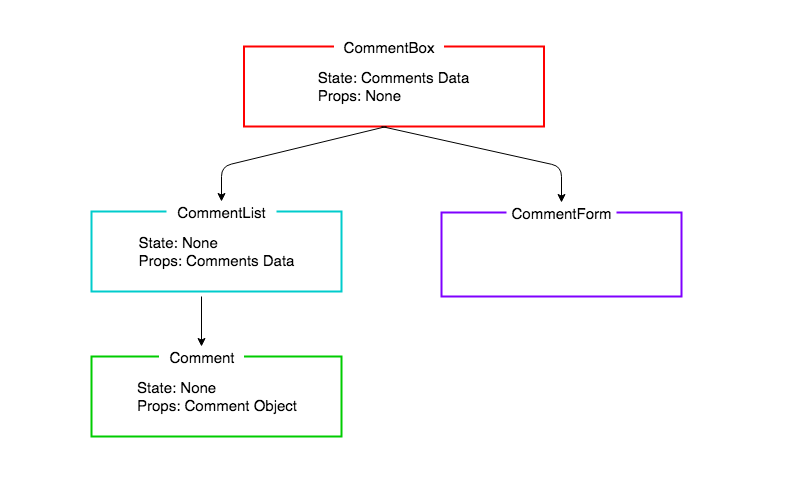

# React Comments

## Learning Objectives

* Create a multiple component React application
* Understand the difference between state and props
* Learn how to pass data between components

## Introduction

We are going to create an application that displays a list of comments and users can add new comments via a form.

## Application Structure

When planning a React app, we divide up the UI into separate components, with each component responsible for rendering a section of the UI. This is what our component structure is going to look like.



*Comments Application Component Structure*

`CommentsBox` will be appended to the HTML root element by React. Then there will be nothing more we need to add to our HTML, the whole application will be drawn by Javascript using React. We do this by describing components for our UI in a component **_hierarchy_**. Any component rendered by another is called the child of its parent component.



*Comments Application Component Hierarchy*

In this lesson we will only be concentrating on the left-hand side of the diagram, rendering a list of comments. In the next lesson we will be adding a form, and updating the state, but it's important to think about the whole application at this point in our planning, because we need to decide which components will have what data for their state and props.

You can see the state and props have already been added to the diagram. The application state is kept high in `CommentBox`. The reason we keep the state high in our React applications is because of React's one-way data flow. We do not pass data across the hierarchy chains in React (unlike with other patterns such as PubSub). Therefore, by keeping the comments data at the top level, all the rendering chains can have access to it: the `CommentForm` can update the data, and the `CommentList` and `Comment`s can be re-rendered with new comments as they are added to the collection.

As we are not adding the form until the next lesson, in this lesson we will be building a static application that will render based on a hard coded array of comments. This is often a good place to start with a React application.

### Create React App Boilerplate

Let's use `create-react-app` to bootstrap our application.

```bash
npx create-react-app comments
cd comments
npm start
```

OK! Through the magic of `create-react-app`, we've pulled down all the bits and pieces we need to start off. We do need to tidy up a little bit, though.

```bash
# cmd-t, new tab
cd src
rm logo.svg
```

At this point, the app has broken, because we've removed stuff that we're importing into our app. Let's fix that. And while we're at it, let's remove some default JSX, and render hello world to the page.

```js
import React from "react";
// DELETED
import "./App.css";

function App() {
    return (
      <h1>Hello World!</h1> // MODIFIED
    );
}

export default App;
```

## Containers and Components

We are about to build our first Component, the `CommentBox`. We can put all our components directly in the 'src' folder, but we are going to separate our components into two categories in order to give our application a bit more structure. The two categories are `containers` and `components`.

Both will contain React `Components`, but following convention, if a component contains logic or holds application state, we will put it in the containers directory. If a component just contained presentational code, it will go inside the containers directory.

1. `containers` - Components with logic or application state
2. `components` - Components with presentational code

> Note: The difference between a container and component is not strictly black and white, but with more experience we will see some more of the differences.

Let's make those directories:

```bash
mkdir src/components
mkdir src/containers
```

The approach we are going to take it to create the chain of components and check that each one renders the next, before implementing any of the components' details.

Let's start with the top of the hierarchy, the CommentBox. Because the CommentBox is going to hold our application state it will go in the `containers` directory:

```sh
touch src/containers/CommentBox.js
```

```js
// src/containers/CommentBox.js

import React, { Component } from "react";

class CommentBox extends Component {
  render() {
    return (
      <div className="comment-box">
        Hello, world! I am a CommentBox.
      </div>
    );
  }
}

export default CommentBox;
```

To get this to render to the page, we need to tell `App` to render it.

```js
import React from "react";
import CommentBox from "./containers/CommentBox"; // NEW

function App() {
    return <CommentBox /> // MODIFIED
  }
}

export default App;
```

> Note: We don't need the parentheses (`()`) around the return value, because it is on one line.

Once that is working, we will work our way down the hierarchy, next making the CommentList. The comment list won't store application state, its sole responsibility will be to be passed the data and render a collection of `Comment` components.

```bash
touch src/components/CommentList.js
```

```js
// src/components/CommentList.js
import React, { Component } from "react";

class CommentList extends Component {
  render() {
    return (
      <div className="comment-list">
        Hello, world! I am a CommentList.
      </div>
    )
  }
}

export default CommentList;
```

For it to be displayed on the page we need to tell our `CommentBox` component to render it. Let's also add a title.

```js
// src/containers/CommentBox.js
import React, { Component } from "react";
import CommentList from "../components/CommentList"; // NEW

class CommentBox extends Component {
  render() {
    return (
      <div className="comment-box">
        <h2>Comments</h2> // MODIFIED
        <CommentList /> // NEW
      </div>
    );
  }
}

export default CommentBox;
```

## Comment Component

The last component is the `Comment` component in the hierarchy and as it is only responsible for receiving data and rendering it to the screen, it will go in the 'components' directory.

```sh
touch src/components/Comment.js
```

```js
// src/components/Comment.js
import React, { Component } from "react";

class Comment extends Component {
  render() {
    return (
      <div className="comment">
        Hello World I am a comment
      </div>
    );
  }
}

export default Comment;
```

By the end of this lesson our `CommentList` is going to dynamically render the collection of comments it's passed, but for now we are going to hard code a couple of `Comment` components, to ensure we don't have any errors in the presentation code.

```js
// src/components/CommentList.js

import React, { Component } from "react";
import Comment from "./Comment"; // NEW

class CommentList extends Component {
  render() {
    return (
      <div className="comment-list">
        <Comment /> // NEW
        <Comment /> // NEW
      </div>
    );
  }
}

export default CommentList;
```

We should now see those two comments being rendered to the screen. Next's let's populate the comments with come text. Again, by the end of the lesson this content for each comment will be stored in the collection of data, but for now we will hard code the values in, to ensure our `Comment` component is rendering it properly.

Let's pass the author and comment to the `Comment` component as props. We will pass an 'author' property as we have been doing with props previously, but the comment text we are going to use a special kind of property, called `children`. The `children` props refers to any text or elements passed between the JSX opening and closing tags.

```js
render() {
  return (
    <div className="comment-list">
      <Comment author="Rick Henry">React is such a great framework!</Comment> // MODIFIED
      <Comment author="Valerie Gibson">I am dreaming in React.</Comment> // MODIFIED
    </div>
  );
}
```

Let's now modify our `Comment` component to render this information. We will be accessing the 'author' property, as before, with `this.props.author`. The text we passed between the `<Comment>` tags we can access with `this.props.children`.

```js
// src/components/Comment.js

class Comment extends Component {
  render() {
    return (
      <div className="comment">
        <h4>{this.props.children}</h4> // MODIFIED
        <p>{this.props.author}</p> // NEW
      </div>
    );
  }
}

export default Comment;
```

Now we can see our comments being rendered to the page.

## Data Model

We have hard coded the data in a list of comments. We now want to create an array of comments which will be dynamically rendered by the `CommentList`. We are going to set up our `CommentBox` to be in control of the data. For now it will just store the data, later, when we add a form, it will be responsible for adding new comments to it.

## State

Our `CommentBox` is going to be the master of the state of our application, the array of comments. For now we'll just make some mock data. If we were creating a proper app we could get this from an API or database. The state will be stored in the constructor.

```js
// src/containers/CommentBox.js

class CommentBox extends Component {
  constructor(props) { // NEW
    super(props);
    this.state = {
      data: [
        { id: 1,
          author: "Beth Fraser",
          text: "I love JS more each day."
        },
        { id: 2,
          author: "Alan Russell",
          text: "Just wait until we add the form. It's gonna be so good."
        }
      ]
    };
  }

  // ...
}
```

And let's pass the data as props to the `CommentList` component so it can render it, on the key `data`.

```js

class CommentBox extends Component {
  // ...

  render() {
    return (
      <div className="comment-box">
        <h2>Comments</h2>
        <CommentList data={this.state.data} /> // UPDATED
      </div>
    );
  }
}

```

To check this has worked, if you looking in React Dev Tools and click on:
- `CommentBox` you should see it has the array `data` as state.
- `CommentList` you should see it has the array `data` as props.

## Dynamic Rendering of Data

The `CommentList` has no state, it just has the comments data it has been given by the `CommentBox`. Inside `CommentList` we are going to `map` the array of comment objects (`this.props.data`) into an array of `Comment` components.

```js
// src/components/CommentList.js
class CommentList extends Component {
  render() {
    const commentNodes = this.props.data.map(comment => { // NEW
      return (
        <Comment author={comment.author}>{comment.text}</Comment>
      );
    });

    return (
      <div className="comment-list">
        <Comment author="Rick Henry">React is such a great framework!</Comment>
        <Comment author="Valerie Gibson">I am dreaming in React.</Comment>
      </div>
    );
  }
}
```

We can now return our new array of `Comment` components (`commentNodes`), rather than the hard coded comments.

```js
// src/components/CommentList.js
class CommentList extends Component {
  render() {
    const commentNodes = this.props.data.map(comment => {
      return (
        <Comment author={comment.author}>{comment.text}</Comment>
      );
    });

    return (
      <div className="comment-list">
        {commentNodes} // MODIFIED
      </div>
    )
  }
}
```

Note: We can do this because the `render` function of a React Component must return a DOM element, a collection of DOM elements, or null. In this case we are returning a collection of Components (`Comment`s), which each return DOM elements.

## The `key` Property

You will see there is a warning in the browser console, asking that you give each item in a list a unique identifier on the `key` property. This is because React wants to use its virtual DOM to only re-render specific list items when they change, rather than having to re-render the whole list. By giving each component in the array a unique key, we can solve this problem.

```js
// src/components/CommentList.js
class CommentList extends Component {
  render() {
    const commentNodes = this.props.data.map(comment => {
      return (
        <Comment author={comment.author} key={comment.id}> // MODIFIED
          {comment.text}
        </Comment>
      );
    });
  }

  // ...
}

```

Great we have created a static application that renders a list of comments. Now we have everything in place to add a form, and use the power of React's re-rendering to update the page for us, every time a new comment is added.

## Conclusion

We have seen how to plan the structure of our React applications by creating a hierarchy of components that are each responsible for rending one part of the UI. We have also seen how we can pass a collection of data as props, and to render it dynamically.
