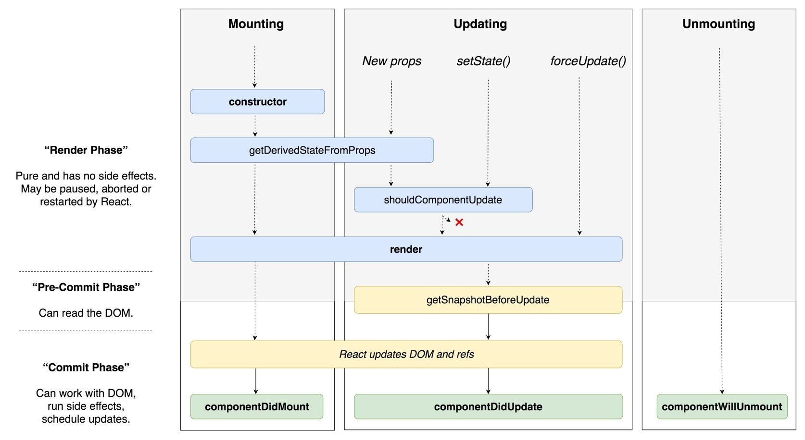

# React Lifecycle

## Learning Objectives
  - Understand that React has lifecycle methods
  - Look at a few of the methods in action

React automatically looks for functions throughout the life of a component.

We can think of a component as having a birth, life and death, just like us!

You won't be using all of these but they are handy to know, especially for getting AJAX data.

We are not required to implement these 'lifecycle' methods but if we choose to, React will run them automatically for us in the order of the lifecycle.

Think of them like hooks that we can use to run some code if need be.

> Open up piggy bank / counter app from first day. Add the following methods in to the main component and see how the lifecycle methods work within it.

## Looking at the lifecycle

Firstly add a console.log to the `render` method. `render` is called every time the component re-renders.

Next let's look at where `componentDidMount` is called:

```js
// ./src/PiggyBank.jsx

  componentDidMount() {
    console.log('Component DID MOUNT!');
    var button = document.querySelector('button');
    console.log("Button:", button);
  }
```

As we can see, we have access to the `button` element on the page, showing that this is called after the `render` function.

Another of the lifecycle methods we can look at is:

```js
// ./src/components/PiggyBank.js

  componentDidUpdate(prevProps, prevState) {
    console.log('Component DID UPDATE!')
    console.log("Previous State:", prevState)
    console.log("Previous Props:", prevProps)
  }
```

This allows is to see the state and props of a component before a re-rendering caused by and update in data.

It doesn't get called on the initial `render`.

## Resources

* Dan Abramov's lifecycle diagram.



* More lifecycle overview:

[http://buildwithreact.com/article/component-lifecycle](http://buildwithreact.com/article/component-lifecycle)
[http://busypeoples.github.io/post/react-component-lifecycle/](http://busypeoples.github.io/post/react-component-lifecycle/)

* Details of all methods (official docs):

[https://facebook.github.io/react/docs/component-specs.html](https://facebook.github.io/react/docs/component-specs.html)
